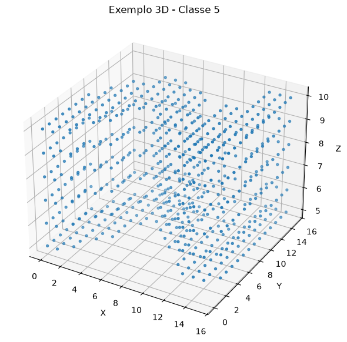
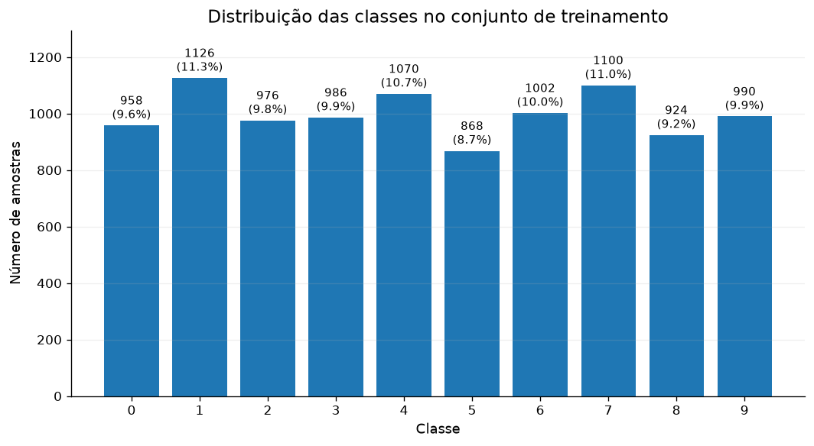
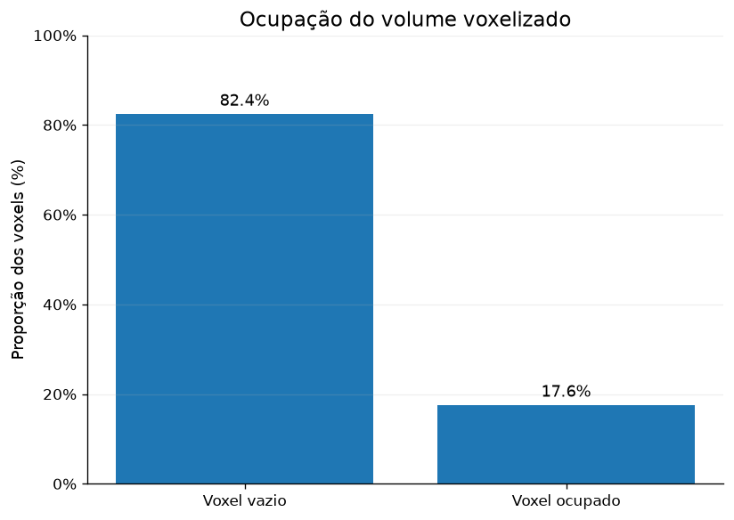
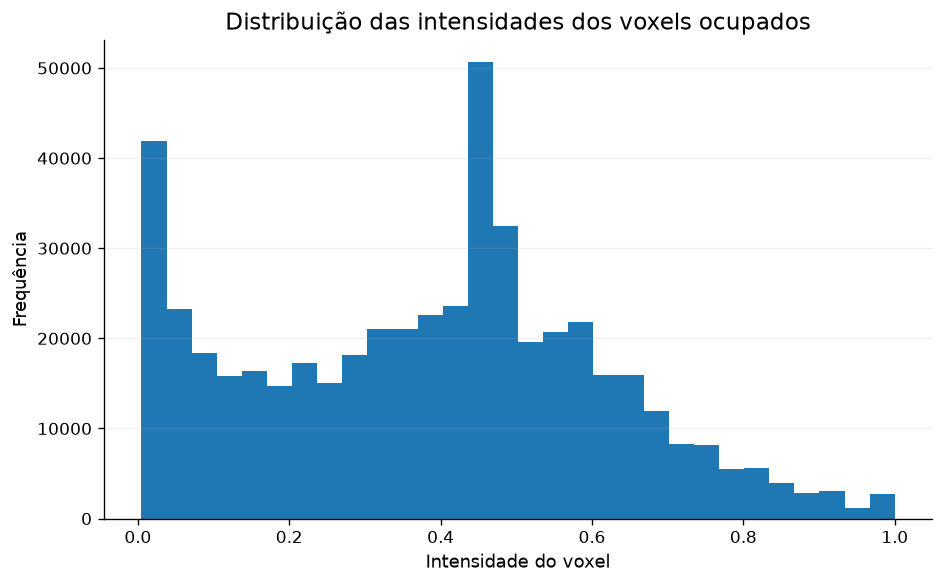
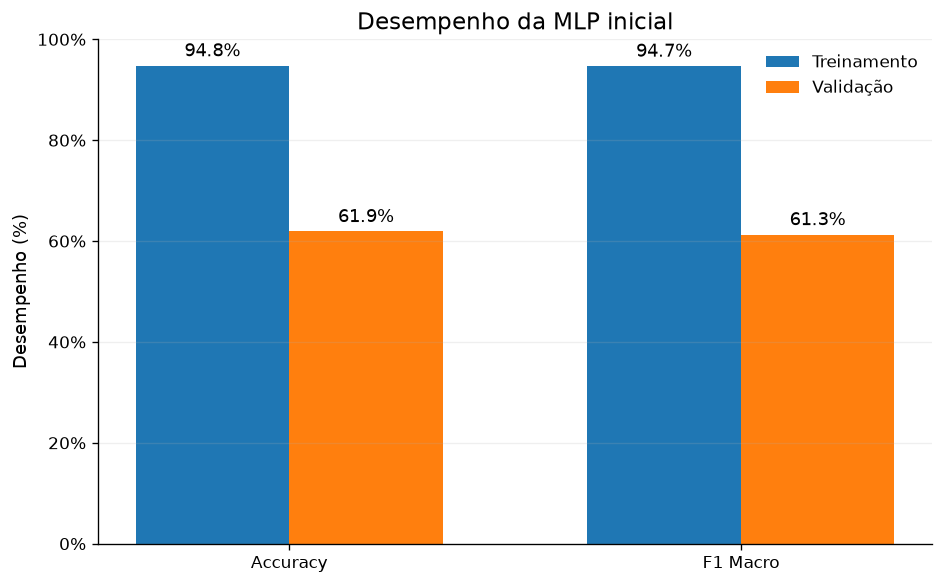
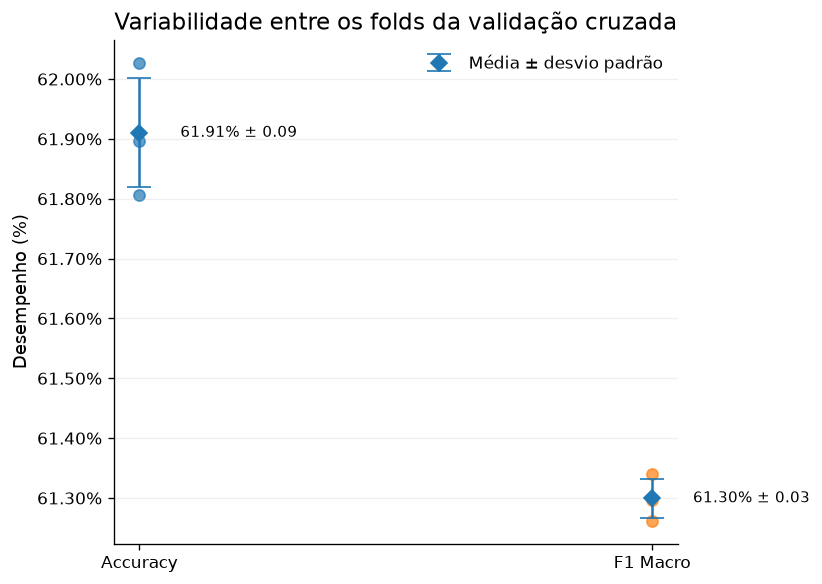
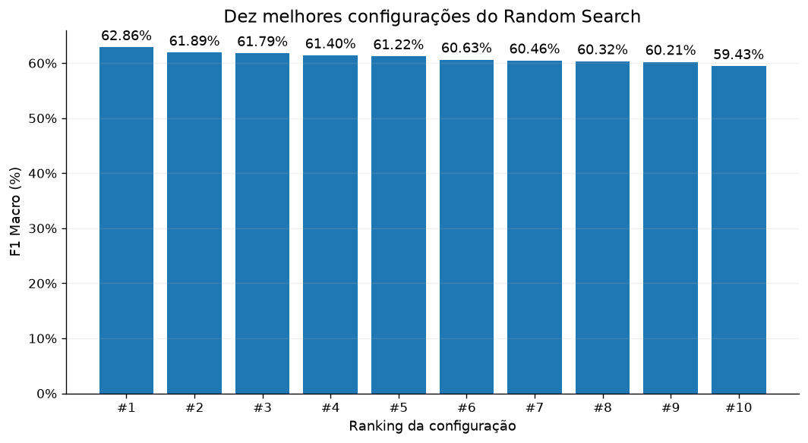
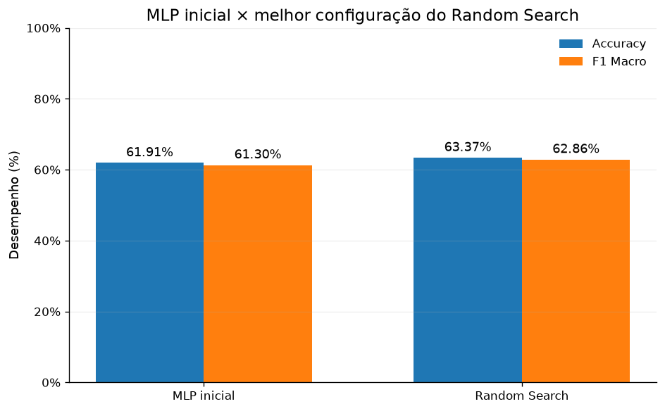

# Otimização de Hiperparâmetros de uma MLP no 3D MNIST

<p align="center">
  <a href="https://github.com/lianeheidemann/3d-mnist-mlp-optimization"></a>
  <a href="https://github.com/lianeheidemann/3d-mnist-mlp-optimization"></a>
  <a href="https://scikit-learn.org/"></a>
  <a href="https://optuna.org/"></a>
  <a href="https://github.com/lianeheidemann/3d-mnist-mlp-optimization/blob/main/LICENSE"></a>

  
</p>

Classificação de dígitos manuscritos em 3D (voxels 16×16×16) com uma rede neural **MLP**, comparando estratégias de otimização de hiperparâmetros: **Random Search** e **TPE (Optuna)**.

> **Status: em andamento (~65%).** Análise exploratória, modelo de referência (baseline) e Random Search concluídos. A busca com TPE e a avaliação final no conjunto de teste ainda estão em desenvolvimento.

## Sumário

- [Objetivo](#objetivo)
- [Dataset](#dataset)
- [Metodologia](#metodologia)
- [Resultados até agora](#resultados-até-agora)
- [Próximos passos](#próximos-passos)
- [Como reproduzir](#como-reproduzir)
- [Estrutura do repositório](#estrutura-do-repositório)

## Objetivo

Avaliar quanto a otimização de hiperparâmetros melhora uma MLP em dados volumétricos e comparar a eficiência de duas estratégias de busca (Random Search × TPE) sob o mesmo espaço de busca, a mesma validação cruzada e o mesmo orçamento de 25 avaliações.

## Dataset

[3D MNIST](https://www.kaggle.com/datasets/daavoo/3d-mnist): dígitos de 0 a 9 convertidos em nuvens de pontos e voxelizados em uma grade 16×16×16, achatada em vetores de 4096 atributos (`full_dataset_vectors.h5`).

| Conjunto | Amostras | Atributos |
|----------|---------:|----------:|
| Treino   | 10.000   | 4.096     |
| Teste    | 2.000    | 4.096     |

- Sem valores ausentes; valores no intervalo [0, 1].
- Classes razoavelmente balanceadas (868 a 1.126 amostras por classe).

<p align="center">
  <br>
  <em>Figura 1 – Voxels ativos de uma amostra.</em>
</p>

<p align="center">
  <br>
  <em>Figura 2 – Distribuição das classes no treino.</em>
</p>

| Classe | 0 | 1 | 2 | 3 | 4 | 5 | 6 | 7 | 8 | 9 |
|--------|--:|--:|--:|--:|--:|--:|--:|--:|--:|--:|
| Quantidade | 958 | 1126 | 976 | 986 | 1070 | 868 | 1002 | 1100 | 924 | 990 |

Os dados são **esparsos**: o volume é majoritariamente vazio, e as intensidades dos voxels ocupados estão distribuídas conforme abaixo.

<p align="center">
  
  <br><em>Figuras 3 e 4 – Ocupação do volume voxelizado e distribuição das intensidades não nulas.</em>
</p>

## Metodologia

- **Pré-processamento:** `StandardScaler` dentro de um `Pipeline` (ajustado apenas nos folds de treino, sem vazamento de dados).
- **Modelo:** `MLPClassifier` (scikit-learn) com early stopping.
- **Validação:** `StratifiedKFold` com 3 folds, embaralhamento e `random_state=42`.
- **Métricas:** Accuracy e **F1 Macro** (métrica principal para seleção de modelos).
- **Baseline:** 1 camada oculta de 128 neurônios, ReLU, Adam, `learning_rate_init=0.001`.
- **Busca:** 25 configurações no mesmo espaço para ambos os métodos.

| Hiperparâmetro | Valores |
|----------------|---------|
| Arquitetura (camadas ocultas) | (32), (64), (128), (64, 32), (128, 64) |
| Ativação | relu, tanh |
| Solver | adam, sgd |
| Batch size | 32, 64, 128 |
| Learning rate inicial | 0.0001, 0.001, 0.01 |
| Alpha (L2) | 0.0001, 0.001, 0.01, 0.1 |
| Paciência do early stopping | 5, 10, 15 |

## Resultados até agora

### Baseline (MLP inicial)

<p align="center">
  <br>
  <em>Figura 5 – Desempenho no treino e na validação.</em>
</p>

<p align="center">
  <br>
  <em>Figura 6 – Resultados por fold (média e desvio padrão).</em>
</p>

### Random Search (25 configurações, 75 ajustes, ~23,7 min)

**Melhor configuração encontrada**

| Parâmetro / Métrica | Valor |
|---------------------|-------|
| F1 Macro de validação | 62,86% |
| Accuracy de validação | 63,37% |
| F1 Macro de treino | 95,62% |
| Arquitetura | (128, 64) |
| Ativação | relu |
| Otimizador | adam |
| Batch size | 32 |
| Learning rate | 0,001 |
| Alpha | 0,001 |
| Paciência do early stopping | 10 |

**Top 10 configurações**

| # | F1 Macro (val.) | Desvio | Accuracy (val.) | F1 Macro (treino) | Arquitetura | Ativação | Solver | Batch | LR | Alpha | Paciência |
|--:|--:|--:|--:|--:|---|---|---|--:|--:|--:|--:|
| 1 | 62,86% | 0,39 | 63,37% | 95,62% | (128, 64) | relu | adam | 32 | 0,001 | 0,001 | 10 |
| 2 | 61,89% | 0,96 | 62,36% | 96,21% | (128,) | relu | adam | 64 | 0,001 | 0,01 | 10 |
| 3 | 61,79% | 1,61 | 62,33% | 95,93% | (64,) | relu | adam | 64 | 0,001 | 0,1 | 10 |
| 4 | 61,40% | 0,51 | 61,97% | 95,98% | (128,) | relu | adam | 64 | 0,0001 | 0,01 | 10 |
| 5 | 61,22% | 0,92 | 61,90% | 91,99% | (64, 32) | relu | sgd | 128 | 0,01 | 0,1 | 5 |
| 6 | 60,63% | 0,57 | 61,27% | 94,24% | (128,) | relu | sgd | 64 | 0,001 | 0,0001 | 10 |
| 7 | 60,46% | 0,79 | 61,06% | 93,28% | (64,) | relu | sgd | 32 | 0,001 | 0,0001 | 15 |
| 8 | 60,32% | 0,64 | 60,89% | 92,60% | (64,) | relu | sgd | 32 | 0,001 | 0,01 | 10 |
| 9 | 60,21% | 0,99 | 60,87% | 92,08% | (128, 64) | relu | sgd | 32 | 0,001 | 0,01 | 10 |
| 10 | 59,43% | 0,76 | 60,17% | 87,91% | (64,) | tanh | sgd | 64 | 0,01 | 0,1 | 5 |

<p align="center">
  <br>
  <em>Figura 7 – F1 Macro das dez melhores configurações.</em>
</p>

Resultados completos das 25 configurações: [`resultados_random_search.csv`](resultados_random_search.csv).

### Baseline × Random Search

| Modelo | Accuracy validação | F1 Macro validação | F1 Macro treino |
|--------|-------------------:|-------------------:|----------------:|
| MLP inicial | 61,91% | 61,30% | 94,70% |
| Melhor Random Search | **63,37%** | **62,86%** | 95,62% |

<p align="center">
  <br>
  <em>Figura 8 – Comparação entre a MLP inicial e a melhor configuração do Random Search.</em>
</p>

### Principais observações

- O Random Search trouxe um ganho de **+1,46 p.p. de Accuracy** e **+1,56 p.p. de F1 Macro** sobre o baseline.
- Há **forte overfitting**: ~95,6% de F1 no treino contra ~62,9% na validação (diferença de 32,76 p.p.), indicando que a regularização e o tratamento dos dados ainda têm bastante espaço para melhorar.
- As melhores configurações usam **ReLU** e, em sua maioria, o solver **Adam**; o **tanh** aparece apenas no top 10 com SGD.
- O desvio padrão entre folds é baixo (< 2 p.p.), então os resultados são estáveis, mas as diferenças entre as 5 primeiras configurações são pequenas.

## Próximos passos

- [ ] Executar a busca com **TPE (Optuna)** no mesmo espaço e orçamento (25 trials).
- [ ] Comparar Random Search × TPE (desempenho e tempo de execução).
- [ ] Avaliar o melhor modelo no **conjunto de teste** (2.000 amostras), com matriz de confusão.
- [ ] Reduzir o overfitting (regularização mais forte, redução de dimensionalidade, etc.).
- [ ] Conclusões finais.

## Como reproduzir

```bash
git clone https://github.com/<seu-usuario>/3d-mnist-mlp-optimization.git
cd 3d-mnist-mlp-optimization
pip install scikit-learn pandas matplotlib optuna h5py jupyter
jupyter notebook Trabalho_MLP_3D_MNIST.ipynb
```

O arquivo `3D MNIST/full_dataset_vectors.h5` deve estar presente (dataset disponível no Kaggle).

## Estrutura do repositório

```
├── 3D MNIST/                     # dataset (HDF5 e scripts auxiliares)
├── output/                       # figuras (.png) e tabelas (.csv/.html) geradas pelo notebook
├── Trabalho_MLP_3D_MNIST.ipynb   # notebook principal
├── resultados_random_search.csv  # resultados completos do Random Search
├── LICENSE
└── README.md
```

## Tecnologias

Python · NumPy · Pandas · scikit-learn · Optuna · h5py · Matplotlib

## Licença

Distribuído sob a licença descrita em [LICENSE](LICENSE).
